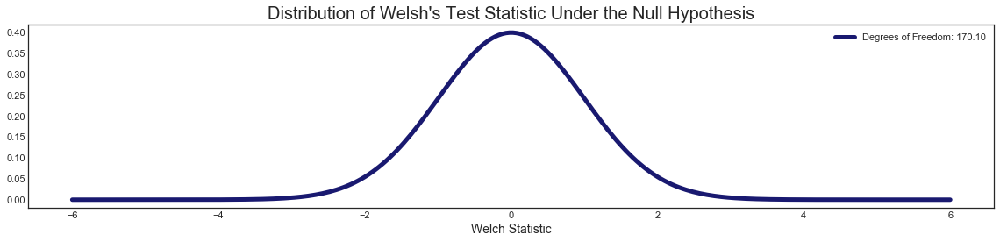
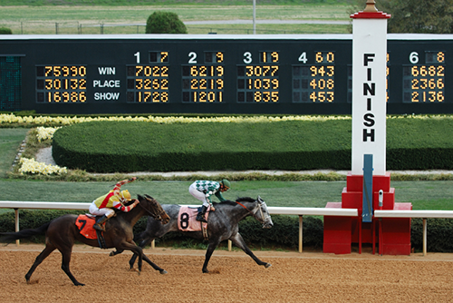

# A run for their money

#### *An Exploratory Data Analysis over 8 years of Hong Kong horse racing history*

#### Jessica Mouras

## Table of Contents
[1. Motivation](#motive)  
[2. Data](#data)
>   [2 i. Pipeline](#pipeline) 
    [2 ii. Feature Exploration](#explore) 
    [2 iii. Evidence for the Motivation](#moto) 
    
[3. Hypothesis Testing](#hypo)
> [3 i. Set-Up](#setup) 
> [3 ii. Welch Test Statistic & Student t- test](#welch) 
> [3 iii. P-value](#pval) 

[4. Conclusion](#conclude)

## Motivation

***
Everyone knows a horse girl. That perhaps, slightly weird chick in elementary school who always wrote horse stories in English. That girl in junior high that was really terrible at gym class sports, but yet could kick butt on those Presidential tests like sit up's and timed runs (bales of hay are 70lbs each, that's why). That teenager who in high school wore leggings with suede knee patches before leggings as pants were cool. FYI, she was wearing riding pants so she could jet off after class to train or compete.

What if I told you that weird child, now a late twenties professional, leveraged her horse knowledge (and some statistics!) to make a couple extra g's a month? 

How?? Did she sell her fancy show horse? Nope, she made several strategic horse racing bets!

Depsite competing as an adult in other horse disciplines, I've always loved horse racing. It brings people together regardless of their motivations, though typically categorized within the following:
+ loving horses 
+ appreciation for high fashion and excessive drinking, looking at you, Derby outfits & mint juleps! 
+ gambling addiction(s) -- usually in addition either of the first two categories...

Having grown up around horses and going so far as to becoming an track certified exercise rider in high school, I wondered what were my keys to success when it came to horse racing betting.

Was my sucess betting on the ponies related to my insider knowledge or was I playing a pretty sucessful, but wild game of chance?

This is my intial exploration into answering that question.

## Data

***
I wanted to explore horse racing data to determine certain factors that impact the speed of a horse during a race. I also wondered if they were statisitically significant when it came to their relationship with speed.

The data includes racing information from the two racecourse venues in Hong Kong.
 * Happy Valley
 * Sha Tin

The data was collected from from the Hong Kong Jockey Club website related to race data between June 1997 and August 2005. 

It contains 79,447 datapoints, which is each horse's "run" for each race over the several year period. This is comprised of 6,047 race events specifically for thoroughbred horses (this is important as it is a specifically narrow population of a nationally recognized sport) and 4,280 unique, registered horses.

### Pipeline

Where I got the data:

+ Kaggle.com: [Horse Racing in Hong Kong:](https://www.kaggle.com/gdaley/hkracing#runs.csv)

This dataset includes two csv files:

+ Races
+ Runs

I used python to import them, specifically the pandas library, and grouped them into dataframes. I proceeded to do all my calculations and tests within python deploying various libraries including scipy, matplotlib, seaborn, and numpy to analyze and visualize the data.

### Feature Exploration

What matters most in horse racing. *__Speed.__* It is a race afterall, right? I knew I wanted to analyze a relationship of some other factor and its impact on race horse speed.

Looking at my dataset, I wanted to keep as many records as possible to analyze, so I wanted to look at distribution of all records for the time taken to run 1200 meters.

  

Welp. What IS that. Why is time over 1200m a trimodal distribution? That doesn't seem "normal". Well, after examining my data further, I knew there was some feature that was splitting the population naturally into 3 different normal distributions. I looked into my dataset and determined the culprit: *race total distance.*
| distance | count |
|----------|-------|
| 1200     | 24695 |
| 1400     | 14564 |
| 1650     | 13253 |
| 1000     | 8523  |
| 1600     | 8329  |
| 1800     | 7320  |
| 2000     | 1463  |
| 2200     | 1034  |
| 2400     | 262   |

That makes sense now, doesn't it? The speed of a horse racing a shorter distance will be faster over the first 1200m because that is the total distance of the race; whereas, a horse with 2000m to run will run slower pace per meter for the first 1200m as it has a greater distance to run.

Since my dataset was originally close to 80,000 datapoints. I reduced my analyzed population to races of 1200m (slightly less than 1 mile), which had approximately 24,000 data points.

The new distribution looks very normal.

  

From this new population, I wanted to see what features would impact speed. A quick way to look for relationships between features in a dataset is to review the correlations.

  

Hm, not very promising. A lot of features that would be valuable to examine are not numerical, they are categorical. This heatmap shows relationships to values that are either calculated from each other (time1, time2, time3 and total_time) or direct common known results of each other. 

E.g. horse age vs prize or win odds vs total time. Horses are grouped into 'fair fields' via age and only certain prize amounts are available to horses of a certain age and win odds are calculated off a horse's speed over historical time, respectively.

Weight would be very interesting to review. I had two options for examining weight. Jockey weight and horse weight. Let's see what that looks like!

  

Not much to see here. Ultimately a flat trend. Per experience riding, what really matters is the jockey's skill more so than a few incremental lbs. To a horse, a better rider is worth more than a marginally lighter load.

  

Okay this is pretty cool, it looks like there is a slight linear relationship between horseweight and total time to cover 1200m. Pro tip: slight matters in horse racing. Often .00X of a second determines outcomes.

It appears that the heavier the horse, the faster the time over 1200m. This, too, makes sense. Hear me out. If we relate it to human racing there are some insights. The distance of 1200m for a horse is a sprint, quivalent to 400m or less for a human. Think of speed record holding sprinters like [Usain Bolt](https://en.wikipedia.org/wiki/Usain_Bolt). He's 6'5 & 207lbs. Compare him to marathon world record holder [Eliud Kipchoge](https://en.wikipedia.org/wiki/Eliud_Kipchoge). Kipchoge is 5'6 and 126 lbs. Both are incredibly fast, over very different distances, and have very different weights.

Regardless, I wated to move on from what appears to be non-independent features. I decided to examine categorical values outside of weight. Remember, the ultimate goal here is to is to perform a hypothesis test. 

### Evidence for Motivation

Apparently, Hong Kong has only 2 racecourse venues: Happy Valley and Sha Tin. Hong Kong is small, that's logical. I wondered if there was a difference between the 1200m times between the two venues.

  

Wow, I wasn't expecting that.

First, I want to make sure this is legitimate. This data is telling me the central tendencies between the two venues have a nearly 0.5 second difference.

To ensure that I am performing a controlled experiment. I had to reduce the population further as Happy Valley only has turf races at the 1200m distance and Sha Tin has both turf and dirt. I did not want to inadvertently include effects of surface type disparity in this test.

Everything from here onward is 1200m races on turf only.

Next, let's take a look at the distributions of these two sub-populations, they could be a good candidate for a hypothesis test.

  

Shown another way, let's take a very large sample (over 80% of total population size) from each of these: 8,000.

## Hypothesis Testing

***
### Set-up

+ My null hypothesis is that the venue (Happy Valley or Sha Tin) will have no impact on the average horse's speed over a 1200m distance.

+ My alternative hypothesis is that the venue will have an impact on the horse's average speed over a 1200m distance.

We are looking to examine differences in population averages between Happy Valley 1200m race population time vs. Sha Tin 1200m race population time.

To test the null hypothesis, we have to establish the following:

+ the two populations examined have independent variances/ standard deviations
+ each of the population variances are independent parameters and are not related to the population means

As the data collected is, essentially, a sample of all total instances, we do not know the true population variances. As such, I used an estimate the variance of a normal distribution from the samples being tested. 

We can use the following formula to represent the Null Hypothesis ("H" for Happy Valley and "S" for Sha Tin).

Using this estimation of the population variance makes the p-value test less certain. Since we are aiming to be conversative, the traditional Normal distribution is too "precise" to use when calculating p-value.

### Welch Test Statistic & Student t-test

To begin to calculate our p-value, we need to perform standardization. This means we use sample statistic whose variance is 1 (as the mean is assumed to be 0). Typical inputs for a standard normal distribution. Standardization is performed by using the Welch Test Statistic calculation.

__The result for this sample test is -3.20.__

Continuing our quest to determine a p-value to help us determine if we can can reject or fail to reject our Null hypothesis, we still cannot use a normal distribution. We must now use a [Student's t-distribution](https://en.wikipedia.org/wiki/Student%27s_t-distribution), which accounts for the fact that we don't know population standard deviation, as discussed above.

We also know our distributions are very normal. So we do have an a-priori reason to deploy the t-test.

The Student-t distirbution uses degrees of freedom calculated via the Welch_Satterhwaithe equation. The higher the degrees of freedom, the tighter and more normal the distribution becomes. 

__The calculated degrees of freedom for the sample test is 170.1.__

The t-distribution takes in the above calculated degrees of freedom. The high calculated degrees of freedom above means that our distribution is very normal.
We know this already.
Time to get to the p-value! But first, let's take a moment to visualize our sample data. See anything interesting that indicates what our p-value is expected to be? Here's a hint:

### P-value

If you paid attention in your Stats classes (or use some good old logic). You likely have an approximate p-value range in mind from the above visualization of the sample times for the two racecourse venues.
But before we get "down to the wire" and calculate our p-value represented by the below probability.

We need establish how surprised you need to be to reject the null hypothesis that there is no difference in the average time to race 1200m based on venue. 

This is the critical value (alpha) that defines the sensitivity of the testing. It is the False Positive (Type 1 error rate) which implies the rate at which the Null was rejected while it was ultimately True.

As horse racing is a fast-paced sport with often very small time increments determining outcomes, I set the critical value at 0.01, lower than the standard 0.05.

The first p-value calculated answers this question:

**_Do we have enough evidence to conclude that one racecourse has a statistically significant difference in average times over 1200m on turf from other other venue?_**

+ The p-value for different average times over 1200m on turf between Happy Valley and Sha Tin:

+ This is below our critical value of 0.01, meaning that we can conclude that there is a difference in average times over 1200m on turf.

+ We reject our Null hypothesis!

The second p-value calculated answers the final question:

**_Which racecourse has a greater average time (meaning that horses run slower on it!) over 1200m on turf?"_**

+ The p-value for Happy Valley racecourse having greater time over 1200m distance on turf than Sha Tin is:

+ Again, we are below our critical value of 0.01.
+ We reject our Null hypothesis again!

## Conclusion

***

Although we were able to reject our Null hypothesis and determine that there is a statistically significant difference between the average 1200m running times between the two racecourse venues, we perhaps did not come to any good "traditional" betting insights.

Why? Well, all that we proved was that on average, horses run slightly faster at Sha Tin than they do at Happy Valley. You could perhaps propose a bet (marginally illegal) among friends that a horse will run 1200m under a certain time-- and only make that bet if the race is held at Sha Tin!!

  

